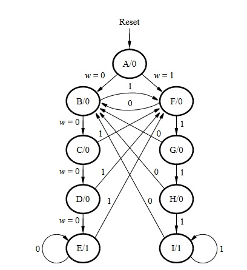
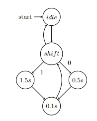
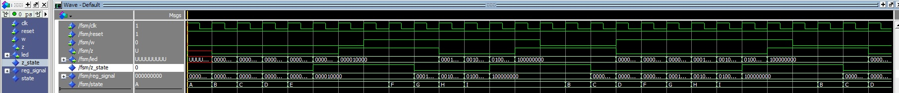

## Integrantes do grupo

Vinícius Souza Freitas - 15491959

Ryan Diniz Pereira - 15590907

## Parte 1

A parte 1 foi feita assim como descrita pelo exercício utilizando da maquina de estados para salvar a quantidade de clocks na qual o input w se manteve em um valor. A maquina de estados segue a mesma lógica daquela descrita pela imagem:
<p align='center'>
    
</p>

A maquina de estados segue uma lógica simples, se w continuar no mesmo valor o estado da maquina avança para proximo estado para esse valor de w. Se w trocar de valor no meio de uma coluna de estados se avança para o primeiro estado do valor oposto. Quando o estado da maquina é o ultimo de uma coluna de valor de w z se torna 1 e enquanto w se manter o mesmo z se manterá o mesmo.

### Código

Instanciação dos flip flops de cada estado:

``` vhdl
ff0: reg1bit port map( clk => clk, reset => '1', data => reg_signal(0), q => led(0));
ff1: reg1bit port map( clk => clk, reset => '1', data => reg_signal(1), q => led(1));
ff2: reg1bit port map( clk => clk, reset => '1', data => reg_signal(2), q => led(2));
ff3: reg1bit port map( clk => clk, reset => '1', data => reg_signal(3), q => led(3));
ff4: reg1bit port map( clk => clk, reset => '1', data => reg_signal(4), q => led(4));
ff5: reg1bit port map( clk => clk, reset => '1', data => reg_signal(5), q => led(5));
ff6: reg1bit port map( clk => clk, reset => '1', data => reg_signal(6), q => led(6));
ff7: reg1bit port map( clk => clk, reset => '1', data => reg_signal(7), q => led(7));
ff8: reg1bit port map( clk => clk, reset => '1', data => reg_signal(8), q => led(8));
ffz: reg1bit port map( clk => clk, reset => '1', data => z_state, q => z);
```

Os estados da maquina: 

``` vhdl
    type state_type is (A, B, C, D, E, F, G, H, I);
    signal state : state_type := A;
```

A implementação da transição entre estados: 

``` vhdl 
case state is
    when A =>
        z_state <= '0'; 
        reg_signal(0) <= '1';
        reg_signal(8 downto 1) <= (others => '0');

        if (w = '1') then
            state <= F; 
        else 
            state <= B;
        end if;
    when B =>
        z_state <= '0';
        reg_signal(0) <= '0';
        reg_signal(1) <= '1';
        reg_signal(8 downto 2) <= (others => '0');

        if (w = '1') then
                state <= F;
        else 
            state <= C;
        end if;
    when C =>
        z_state <= '0';
        reg_signal(1 downto 0) <= (others => '0');
        reg_signal(2) <= '1';
        reg_signal(8 downto 3) <= (others => '0');

        if (w = '1') then
            state <= F;
        else 
            state <= D;
        end if;
    when D =>
        z_state <= '0';
        reg_signal(2 downto 0) <= (others => '0');
        reg_signal(3) <= '1';
        reg_signal(8 downto 4) <= (others => '0');

        if (w = '1') then
            state <= F; 
        else
            state <= E;
        end if;
    when E =>
        z_state <= '1';
        reg_signal(3 downto 0) <= (others => '0');
        reg_signal(4) <= '1';
        reg_signal(8 downto 5) <= (others => '0');

        if (w = '1') then
            state <= F;
        else
            state <= E;
        end if;
    when F => 
        z_state <= '0';
        reg_signal(4 downto 0) <= (others => '0');
        reg_signal(5) <= '1';
        reg_signal(8 downto 6) <= (others => '0');

        if (w = '1') then
            state <= G;
        else 
            state <= B;
        end if;
    when G =>
        z_state <= '0';
        reg_signal(5 downto 0) <= (others => '0');
        reg_signal(6) <= '1';
        reg_signal(8 downto 7) <= (others => '0');

        if (w = '1') then
            state <= H;
        else 
            state <= B;
        end if;
    when H => 
        z_state <= '0';
        reg_signal(6 downto 0) <= (others => '0');
        reg_signal(7) <= '1';
        reg_signal(8) <= '0';

        if (w = '1') then
            state <= I;
        else 
            state <= B;
        end if;
    when I => 
        z_state <= '1';
        reg_signal(7 downto 0) <= (others => '0');
        reg_signal(8) <= '1';

        if (w = '1') then
            state <= I;
        else 
            state <= B;
        end if;
end case; 
``` 

O código que contem a outra tabela verdade requer a modificação minima de mudar o reset para todos os bits em zero, e associar o flip flop de A para 1 em todos os estados que não são o A. 

Esse código esta localizado [./codigos/part1/fsm_mod.vhd](https://github.com/vinivid/Aula8-P-SD/blob/main/codigos/part1/fsm_mod.vhd)

## Parte 4

O problema 4 possui duas partes principais, uma é ler a entrada do código morse a outra é enviar o código morse através do led. Para a parte de ler a entrada podemos criar um estado no qual a maquina não faz nada e apenas espera pela entrada de um código. Após receber o código armazena o tamanho da palavra e uma série de bits que representa cada carácter da palavra. 

Para enviar o código morse por led o seguinte foi feito. Os caracteres da palavra são salvos em uma registradora de shift. Também serão utilizados tres contadores, um de 1.5 s o qual representara o tempo no qual uma barra (representada como 1 em binário) ficara aceso, outro de 0.5 s que representa o tempo em que o ponto (0 em binário) ficara aceso e por ultimo um de 0.1 s que sera o tempo no qual o led fica apagado para que se tenha um intervalo entre sinais.

Com isso podemos representar o processo de representar o código morse a partir de estados. um estado, um estado chamado *shift* responsável por adquirir o próximo bit da palavra e verificar se ja foram representadas todas as letras verificando se a quantidade de vezes que se ja ligou o led é igual ao tamanho da palavra, se isso for real vai para o estado de *idle*, dependo do caractere que se esta nesse estado o próximo estado sera *print_1p5* ou *print_0p5*. Ambos esse estados deixam a led acessa por 1.5 s ou 0.5 s usando os contadores, após esse período é avançado para o estado de *print_0p1* em que se deixa a a led apagada por 0.1 s e se adiciona 1 na quantidade de caracteres representados. Após isso se retorna ao estado de shift até que a palavra inteira seja representada.

<p align='center'>
    
</p>

## Simulação



## Código

Shift register

``` vhdl
library IEEE;
use IEEE.std_logic_1164.all;
use IEEE.numeric_std.all;

entity shift_reg is
    port (
        clk : IN STD_LOGIC;
        enable : IN STD_LOGIC;
        reset : IN STD_LOGIC;
        d : IN STD_LOGIC_VECTOR(3 downto 0);
        d_out : OUT STD_LOGIC := '0'
    );
end entity shift_reg;

architecture Behaviour of shift_reg is
    signal word : STD_LOGIC_VECTOR(3 downto 0) := (others => '0');
begin
    process (clk, reset)
    begin
        if (reset = '1') then
            word <= d;
        elsif (rising_edge(clk)) then
            if (enable = '1') then
                word <= word(2 downto 0) & word(3);
            end if;
        end if;
        
    end process;
    
    d_out <= word(3);
    
end architecture Behaviour;
```

Estados
``` vhdl
type state_type is (idle, shift, print_1p5, print_0p5, print_0p1);
signal state : state_type := idle;
```

Maquina de estados finitos: 

``` vhdl
architecture Behaviour of fsm is
    component shift_reg is
        port (
            clk : IN STD_LOGIC;
            enable : IN STD_LOGIC;
            reset : IN STD_LOGIC;
            d : IN STD_LOGIC_VECTOR(3 downto 0);
            d_out : OUT STD_LOGIC := '0'
        );
    end component;

    component rcounter is
        generic (
            modulo : INTEGER := 4;
            min : INTEGER := 0;
            max : INTEGER := 8
        );
        port (
            clk : IN STD_LOGIC;
            reset : IN STD_LOGIC;
            enable : IN STD_LOGIC;
            roll : OUT STD_LOGIC
        );
    end component;

    --Estados da maquina de estados
    type state_type is (idle, shift, print_1p5, print_0p5, print_0p1);
    signal state : state_type := idle; --Inicia em idle pois esta esperando uma palavra

    --O estado da led
    signal led_state : std_logic := '0';

    --O tamanho da palavra e quantas letras ja foram printadas
    signal size : integer range 0 to 4;
    signal qtt_printed : integer range 0 to 4;
    
    --Sinais da shift register
    signal shift_assign : STD_LOGIC_VECTOR(3 downto 0);
    signal symbol : STD_LOGIC;
    signal shift_enable : STD_LOGIC := '0';
    signal shift_reset : STD_LOGIC := '0';

    --Sinais dos clocks
    signal clock5_enable : std_logic;
    signal clock5_reset : std_logic;
    signal clock5_roll : std_logic;

    signal clock1p5_enable : std_logic;
    signal clock1p5_reset : std_logic;
    signal clock1p5_roll : std_logic;

    signal clock1_enable : std_logic;
    signal clock1_reset : std_logic;
    signal clock1_roll : std_logic;

    signal curr_symbol : std_logic;
begin
    shift_re: shift_reg
     port map(
        clk => clk,
        enable => shift_enable,
        reset => shift_reset,
        d => shift_assign,
        d_out => symbol
    );
    
    --25000000
    c0p5: rcounter
     generic map(
        modulo => 2,
        min => 0,
        max => 30000000
    )
     port map(
        clk => clk,
        reset => clock5_reset,
        enable => clock5_enable,
        roll => clock5_roll
    );
    --75000000
    c1p5: rcounter
     generic map(
        modulo => 3,
        min => 0,
        max => 80000000
    )
     port map(
        clk => clk,
        reset => clock1p5_reset,
        enable => clock1p5_enable,
        roll => clock1p5_roll
    );
    --5000000
    c0p1: rcounter
     generic map(
        modulo => 1,
        min => 0,
        max => 6000000
    )
     port map(
        clk => clk,
        reset => clock1_reset,
        enable => clock1_enable,
        roll => clock1_roll
    );

    --pontos sao 0 e linhas sao 1 
    process (clk, reset)
    begin
        if (reset = '0') then
		clock1_reset <= '1';
		clock5_reset <= '1';
		clock1p5_reset <= '1';
		shift_reset <= '1';
		led_state <= '0';
		state <= idle;
        elsif (rising_edge(clk)) then
            case state is
                when idle =>
                    led_state <= '0';
		            shift_enable <= '0';
			        shift_reset <= '0';

                    if (enable = '0') then
                        case word is
                            when "000" =>
				                shift_reset <= '1';
                                size <= 2;
                                shift_assign <= "0100";
				                curr_symbol <= '0';
                                state <= shift;
                            when "001" => 
		    		            shift_reset <= '1';
                                size <= 4;
                                shift_assign <= "1000";
				                curr_symbol <= '1';
                                state <= shift;
                            when "010" =>
		    		            shift_reset <= '1';
                                size <= 4;
                                shift_assign <= "1010";
				                curr_symbol <= '1';
                                state <= shift;
                            when "011" => 
		    		            shift_reset <= '1';
                                size <= 3;
                                shift_assign <= "1000";
				                curr_symbol <= '1';
                                state <= shift;
                            when "100" => 
		    		            shift_reset <= '1';
                                size <= 1;
                                shift_assign <= "0000";
				                curr_symbol <= '0';
                                state <= shift;
                            when "101" => 
		    		            shift_reset <= '1';
                                size <= 4;
                                shift_assign <= "0010";
				                curr_symbol <= '0';
                                state <= shift;
                            when "110" => 
		    		            shift_reset <= '1';
                                size <= 3;
                                shift_assign <= "1100";
				                curr_symbol <= '1';
                                state <= shift;
                            when "111" => 
		    		            shift_reset <= '1';
                                size <= 4;
                                shift_assign <= "0000";
				                curr_symbol <= '0';
                                state <= shift;
			                when others =>
		    		            shift_reset <= '1';
				                size <= 0;
                                shift_assign <= "0000";
				                curr_symbol <= '0';
                                state <= idle;
                        end case; 
                    end if;
                when shift =>
                    --Desabilitando todos os contadores e a shift register
		            shift_reset <= '0';
                    clock1_enable <= '0';
                    clock5_enable <= '0';
                    clock1p5_enable <= '0';

                    --Resetando todos os contadores
                    clock1_reset <= '1';
                    clock5_reset <= '1';
                    clock1p5_reset <= '1';
		
                    led_state <= '0';
							
		                    shift_enable <= '1';

                    if (qtt_printed = size) then
                        shift_enable <= '0';
                        shift_reset <= '1';
			        qtt_printed <= 0;
                        state <= idle;
                    elsif (curr_symbol = '1') then
                        state <= print_1p5; 
                    else 
                        state <= print_0p5; 
                    end if;
                when print_1p5 =>
		            shift_enable <= '0';
		            shift_reset <= '0';
                    clock1p5_reset <= '0';
                    clock1p5_enable <= '1';

                    led_state <= '1';

                    if (clock1p5_roll = '1') then
                        state <= print_0p1;
                    end if;
                when print_0p5 =>
		            shift_enable <= '0';
		            shift_reset <= '0';
                    clock5_reset <= '0';
                    clock5_enable <= '1'; 

                    led_state <= '1';
                    
                    if (clock5_roll = '1') then
                        state <= print_0p1;
                    end if;
                when print_0p1 =>
		            shift_enable <= '0';
		            shift_reset <= '0';
                    clock1_reset <= '0';
                    clock1_enable <= '1';

                    led_state <= '0';

                    if (clock1_roll = '1') then
			        curr_symbol <= symbol;
			        qtt_printed <= qtt_printed + 1;
                    state <= shift;
                    end if;
            end case;
        end if;
    end process;
    
    led <= led_state;

end architecture Behaviour;
```